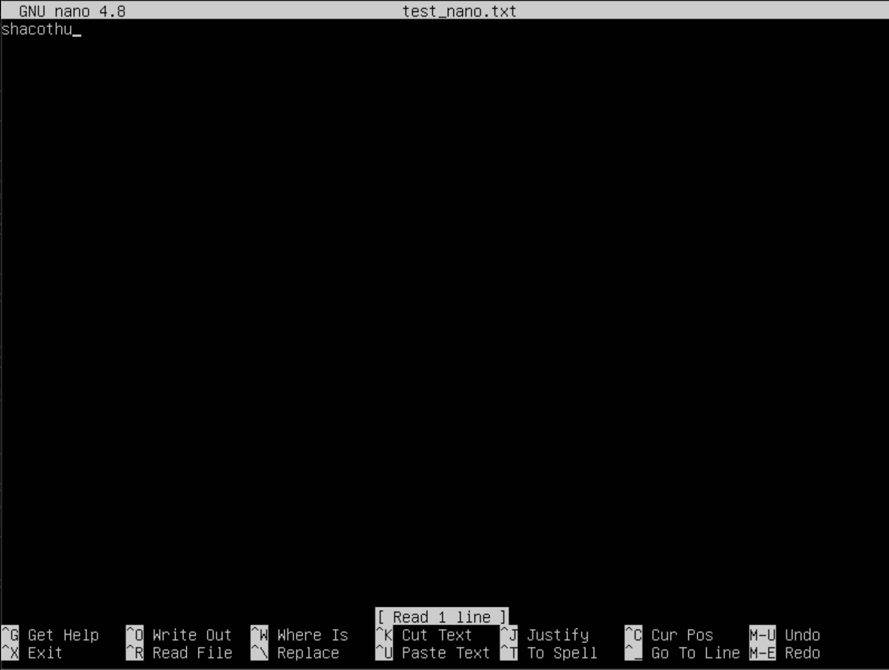
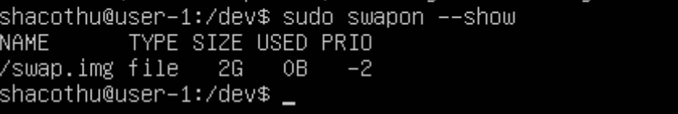
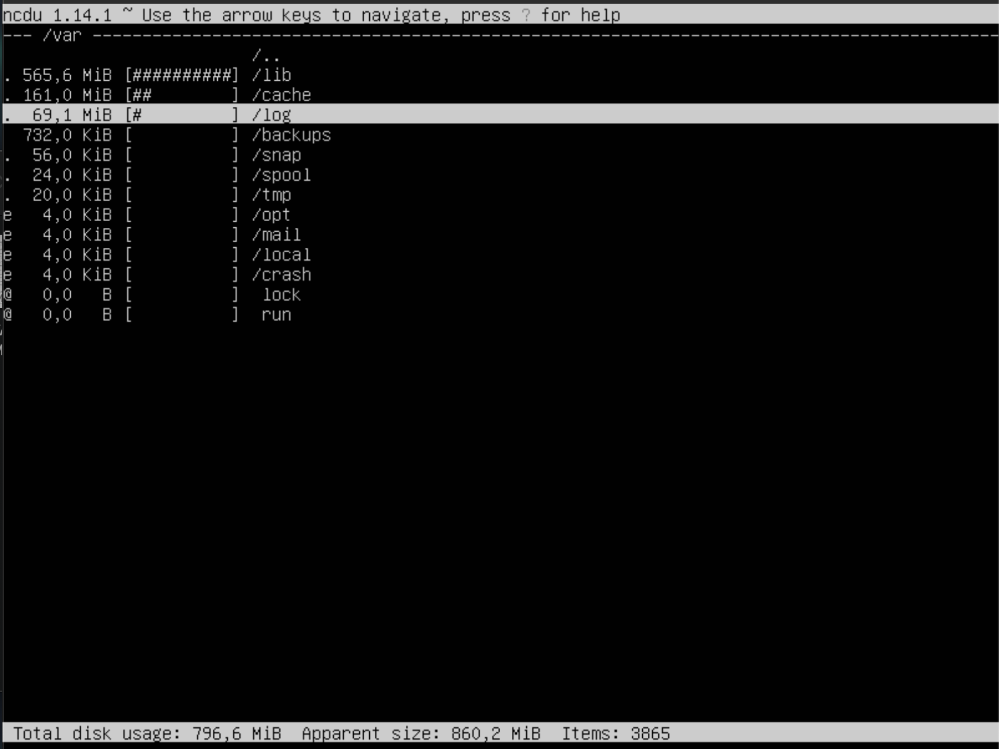

## Part 1. Установка ОС
- Версия системы:


```
cat /etc/issue```

##Part 2. Создание пользователя
- Создание пользователя:


```
sudo adduser user1
```
- Чтение логов:


```
sudo usermod -aG adm user1
```

- cat /etc/passwd


```
cat /etc/passwd
```

##Part 3. Настройка сети ОС
- Изменение имени хоста


```
sudo hostname user-1
```
Проверяю есть ли изменения(их не было и я изменил сам)

```
cat /etc/hostname
```

```
sudo vim /etc/hosts
```


Меняю строку 127.0.0.1 shacothu -> 127.0.0.1 user-1. Сохраняю и пишу

 ```
 sudo reboot
 ```
 - Установка временной зоны, соответствующей текущему местоположению. В Казани время по Москве
 
 
 
```
sudo timedatectl set-timezone Europe/Moscow
```

```
timedatectl 
```

- Вывод названий сетевых интерфейсов с помощью консольной команды


```
ip link show
```
Наличие интерфейса lo(loopback) объяснется тем, что присутствует связь компьютера с самим собой, т.е. данные, передаваемые этим компьютером, принимаются этим же компьютером)

- IP адрес устройства от DHCP сервера


```
hostname -I
```

- Определение внешнего ip-адреса шлюза (ip)


```
curl icanhazip.com
```

DHCP - Dynamic Host Configuration Protocol — протокол динамической настройки узла, автоматически предоставляет IP адреса и другие настройки сети

- Определение внутреннего ip-адреса шлюза (gw)


```
ip route
```
- Установление статичных сетевых настроек 

Открытие файла:


```
sudo vim /etc/netplan/*.yaml
```

После изменений:


- Применение изменений и перезапуск виртуальной машины


```
sudo netplan apply
```

```
reboot
```

- Пинг хостов 1.1.1.1 и ya.ru


```
ping 1.1.1.1
```


```
ping ya.ru
```

##Part 4. Обновление ОС
Обновление ОС

```
sudo apt-get upgrade
```

После обновления 


##Part 5. Использовние команды sudo

Команда **sudo** предоставляет возможность пользователям выполнять команды от имени суперпользователя root, либо других пользователей, т.е. использование sudo позволяет выполнять привилегированные команды обычным пользователям без необходимости ввода пароля суперпользователя root

Необходимо сменить пароль для пользователя, созданного в Part 2

```
sudo passwd user1
```

Затем добавить пользователя в группу с привилегиями sudo

```
sudo usermod -aG sudo user1
```


Проверяю возможность использования sudo, переключившись на нового пользователя и поменяв название хоста


##Part 6. Установка и настройка службы времени

- Установка службы автоматической синхронизации времени


(уже установлено)

- Вывод команды


```
timedatectl show
```
Синхронизация присутствует(наличие NTPSynchronized=yes)

##Part 7. Установка и использование текстовых редакторов

Команды для установки:

```
sudo apt install nano
```

```
sudo apt install vim
```

```
sudo apt install mcedit
```

- **NANO**



Для выхода с сохранением изменений необходимо нажать Ctrl+O, затем подтвердить то, что название файла остается неизменным (Enter), либо изменить его и так же подтвердить изменения (Enter), затем выйти(Ctrl+X)

Для выхода без сохранения изменений Ctrl+X, затем Enter

- **VIM**


Для выхода с сохранением изменений необходимо нажать esc и затем вбить :wq и нажать enter

Для выхода без сохранения изменений нажать esc вбить :q! и нажать Enter

- **MCEDIT**


Для выхода с сохранением изменений необходимо использовать клавиши F2(сохранение) и затем F10(выход) 

Для выхода без сохранения изменений F10, затем стрелками переместится на "No" и нажать Enter

**Поиск и замена слова**

- **NANO**


Ctrl + W для поиска начиная от курсора к концу файла; Ctrl + Q для поиска начиная от курсора к началу файла. Курсор переместится на слово, которое ищут после нажатия на Enter


Для замены необходимо использовать сочетание клавиш Ctrl+\\\, ввести слово, которое будет заменено и затем слово, которым заменяем. После замены повится напись "Replaced 1 occurrence"

- **VIM**


Для поиска нажать  esc, чтобы переключиться в командный режим, затем ввести  / и свой паттерн


Для замены слова необходимо ввести комманду :s/ затем ввести слово, которое необходимо заменить и через / то, на что заменяем

- **MCEDIT**


Для поиска нажать клавишу F7 и ввести строку для поиска


Для замены нажать клавишу F4 ввести заменяемую строку и текст для замены

##Part 8. Установка и базовая настройка сервиса SSHD

- Установка службы ssh 

```
sudo apt install openssh-server
```

- Добавление автостарта службы при загрузке системы 

```
sudo systemctl enable ssh
```


- Перенастройка службы SSHd на порт 2022


- Наличие процесса sshd

```
ps -e | grep sshd
```


Команда ps является очень гибким инструментом для определения работающих в системе программ и оценки используемых ими ресурсов. Ключ -е используется для отображения всех процессов. Утилита grep используется для того, чтобы отобрать нужные процессы по определенному критерию (в данном случае процесс sshd)

- Установка netstat

```
sudo apt install net-tools
```

- Вывод команды netstat -tan


Ключ -n показывает номерные адреса вместо того, чтобы пытаться определить символические.  
Ключ -а показывает все сокеты: и прослушиваемые, и нет.  
Ключ -t показывает TCP-порты.

**Значение столбцов**  
Proto - протокол, используемый сокетом.  
Recv-Q - количество байтов, не скопированных пользовательской программой, подключенной к этому сокету.  
Send-Q - количество неподтвержденных байтов удаленного хоста  
Local Address - локальный адрес (имя локального хоста) и номер порта сокета. Если не указана опция -n, адрес сокета разрешается в соответствии с полным именем хоста (FQDN), а номер порта преобразуется в соответствующее имя службы.  
Foreign Address - удаленный адрес (имя удаленного хоста) и номер порта сокета.  
State - состояние сокета. LISTEN означает ожидание входящих соединений.  
  
**0.0.0.0** в колонке значит, что на данном порту слушаются все сетевые интерфейсы.

##Part 9. Установка и использование утилит top, htop

- Вывод команды **top**


uptime - 58 мин.

количество авторизованных пользователей - 1

общую загрузку системы - 0,00, 0,00, 0,00

общее количество процессов - 103

загрузку cpu - 0.3

загрузку памяти - 158,0/1971,4


Использвание команд top -o %MEM и top -o %CPU, чтобы узнать pid процессов, занимающих больше времени и памяти


pid процесса занимающего больше всего памяти - 677


pid процесса, занимающего больше всего процессорного времени - 484, 1

- Вывод команды **htop**

Сортировка по PID


Сортировка по PERCENT_CPU


Сортировка по PERCENT_MEM


Сортировка по TIME


Отфильтрованный вывод для процесса sshd


Процесс syslog, найденный, используя поиск


Добавленный вывод hostname, clock, uptime


##Part 10. Использование утилиты fdisk


Название жесткого диска - /dev/sda

Размер - 25G

Количество секторов - 52428800



```
sudo swapon --show
```

Размер swap - 2G 

##Part 11. Использование утилиты df

- **Команда df**


Размер раздела - 11758760

Размер занятого пространства - 5047968

Размер свободного пространства - 6091684

Процент использования - 46%

Единица измерения в выводе - килобайты

- **Команда df -Th**


Размер раздела - 12G

Размер занятого пространства - 4,9

Размер свободного пространства - 5,9

Процент использования - 46%

Тип файловой системы для раздела - ext4

##Part 12. Использование утилиты du

- Размер папок


```
sudo du -sh /var/log /var /home
```

```
sudo du -s --block-size=1 /var/log /var /home
```

- Размер всего содержимого в /var/log


```
du -h /var/log/*
```

##Part 13. Установка и использование утилиты ncdu

```
sudo apt install ncdu
```




##Part 14. Работа с системными журналами

```
vim /var/log/dmesg
vim /var/log/syslog
vim /var/log/auth.log
```
Время последней успешной авторизации - 07:01:49

Имя пользователя - shacothu

Метод входа - LOGIN

Перезапуск службы sshd:

```
sudo systemctl restart ssh
tail /var/log/syslog
```


##Part 15. Использование планировщика заданий CRON

Использование планировщика заданий для запуска команды uptime каждые две минуты:

```
crontab -e
```


Строчки о выполнении:


Удаление из планировщика заданий и просмотр текущих заданий для CRON:

```
crontab -r
crontab -l
```


